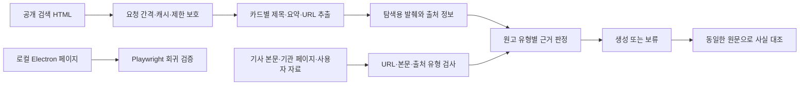

# 현 단계의 수정 결정과 기술적 근거

기준일: 2026-10-05 KST. 공식 검색 API로 전환하지 않는다. 기존 Electron과 공개 웹 수집을 유지하며, 제품 코드 구현은 GPT-6 Luna / max 작업자가 담당한다. 이 문서는 수정 이유와 우선순위를 설명한다. 실행 결과는 STATUS.md와 EVIDENCE_VALIDATION.md에 별도로 기록한다.

## 실패 원인: 확인된 사실과 아직 모르는 부분

작성자 PC의 이전 STATUS에는 HTTP 403과 “검색 서비스 이용이 제한되었습니다” 응답이 기록돼 있다. 당시의 직접 실패 원인은 검색 서버의 접근 제한이다. IP, 요청량, 로그인 세션 중 무엇이 제한을 일으켰는지는 당시 로그 없이 확정할 수 없다.

이번 PC의 개선 전 doctor는 종료 코드 0과 8종의 자료 반환을 확인했다. 따라서 이전 차단을 현재의 장애로 단정하면 안 된다. 반면 블로그 자료 목록에 쇼핑몰·나무위키 제목이 섞여 있어, 응답 건수만으로 수집 성공을 판정하는 방식에는 실제 결함이 있었다.

Playwright의 부재가 과거 403의 원인이라는 근거는 없다. 이 앱은 이미 Electron 브라우저로 동적 페이지를 읽는다. 브라우저를 바꾸는 것만으로 서버의 접근 제한을 해결할 수 있다는 전제는 채택하지 않는다.

## 선택한 구조

검색 요약은 원문을 찾아가는 자료다. 기관 도메인의 링크, URL만 있는 자료, AI 브리핑은 실제 본문을 확보한 원문과 구분한다. 원고 유형에 필요한 근거가 없으면 예약 경로에서 글쓰기 모델 호출 전에 보류한다.

## 우선순위와 수정 내용

| 순서 | 기술 문제 | 수정 결정 | 확인 방법 |
| --- | --- | --- | --- |
| 1 | 전체 페이지의 제목 배열과 요약 배열을 순서대로 연결 | 한 카드에서 제목·요약·URL을 읽고 다른 카드 링크·광고·출처 혼입을 제외 | 요약 누락·위장 도메인·잘못된 링크 fixture |
| 2 | catch → []로 제한·통신 실패·파서 실패를 숨김 | HTTP 상태, 오류 종류, 코드와 결과 종류를 진단에 보존 | 403·429·5xx·시간초과·지원하지 않는 구조 검사 |
| 3 | 메모리 캐시와 차단 유예가 프로세스 종료 시 사라짐 | 제한된 압축 캐시와 유예 상태를 사용자 데이터 폴더에 원자적으로 저장 | 다른 프로세스의 재시작·TTL·손상 항목 검사 |
| 4 | 검색 차단만으로 무조건 원고 보류 | 검색 상태는 경고로, 실제 필요한 원문 부족은 보류로 처리 | 차단+유효 원문 / 차단+링크만 있음 비교 |
| 5 | AI 요약이나 빈 기관 페이지를 공식 근거로 인정 | 실제 HTTP(S) URL·의미 있는 본문·출처 유형으로 원문을 판정 | AI 요약·빈 본문·요약과 원문의 동일 URL 검사 |
| 6 | 렌더 수집이 고정 sleep 후 추출하고 오류 객체를 반환 | 제한 시간 안에서 준비 조건을 검사하며 로드·추출 실패는 명시적 오류로 반환 | 실제 Electron 지연 DOM·제한·HTTP 오류·창 정리 검사 |
| 7 | 경쟁도 미측정을 60/82로 표시 | measured=false, gap=null, reason을 사용처까지 전달 | 수집 실패·날짜 부족·점수 계산 회귀 검사 |

### 출처 연결

기존 화면과 프롬프트가 사용하는 string[] 형식은 유지하되, 수집 경계에서 구조화된 sources를 함께 전달한다. source에는 url, title, text, sourceType, contentKind, collectedAt을 보존한다. publishedAt은 실제 값이 있을 때만 기록한다. 배열을 합치거나 줄일 때에는 선택된 텍스트의 출처만 남긴다. 출처 URL을 확인할 수 없는 텍스트에는 URL을 만들어 붙이지 않는다.

자료 건수가 줄어들 수 있다. 잘못 연결됐거나 출처 유형을 확인하지 못한 결과를 제거한 영향과 실제 검색 결과 없음, 마크업 변경을 진단에서 구분해야 한다. 전후 건수만 비교해 회귀로 결론 내리지 않는다.

### 제한과 캐시

기존 30분 캐시와 제한 유예, 반복 제한 시 2시간 중단을 유지한다. 검색 요청을 직렬 처리하고 간격을 둔다. 제한 응답과 실패 객체는 성공 캐시에 저장하지 않는다. 캐시의 원래 수집 시각을 보존해 재사용한 자료를 새 자료처럼 표시하지 않는다. 손상된 캐시 항목을 무시하더라도 유효한 차단 상태는 유지한다.

보호 범위는 search.naver.com이다. 네이버 검색이 차단돼도 독립적인 자동완성·외부 트렌드 진단까지 BLOCKED로 표시하지 않는다. 이 구현은 여러 앱 프로세스 사이의 전역 요청 큐를 보장하지 않는다. 동시 예약 실행 확대는 후속 운영 문제로 남긴다.

### 원고의 근거와 사실 대조

최신 이슈는 기사·기관·사용자 제공 자료의 원문이 필요하다. 후기는 사용자의 경험 입력이 필요하다. 검색이 차단돼도 필요한 원문이 충분하면 경고와 함께 진행할 수 있다. 주소만 있거나 발췌만 있는 자료는 원문으로 승격하지 않는다. .or.kr 도메인 전체를 공공기관으로 가정하지 않는다.

본문의 최소 길이·출처 유형 검사는 잘못된 입력을 거르는 조건이며, 모든 주장에 관련된 근거가 있다는 보장은 아니다. 생성에 쓰인 원문을 최종 사실 대조에도 전달하고, 지원되지 않는 날짜·금액·고유명사 등은 검수 대상으로 남긴다. 모델 기반 판정의 오판 가능성은 유지된다.

### Electron과 Playwright의 역할

Electron은 기존 앱의 실제 렌더 수집기로 유지한다. Playwright는 개발 의존성으로만 추가해 설치된 Electron을 실행하고 로컬 HTML·로컬 HTTP 응답을 검증한다. 별도 Chrome/Chromium을 제품 수집 경로에 추가하지 않는다. Playwright의 Electron 지원은 공식 문서상 실험적이다: https://playwright.dev/docs/api/class-electron

검색 제한이 확인된 경우 브라우저로 같은 요청을 다시 보내지 않는다. 브라우저 검증은 격리 프로필과 로컬 페이지를 사용하며 사용자 쿠키나 Claude·네이버 로그인 정보를 가져오지 않는다. 로컬 fixture 통과와 실제 서비스의 로그인·에디터 입력·임시저장 성공은 별도로 보고한다.

## 이번 변경 이후의 방향

이번 범위가 통과하면 다음 검증은 앱에서 한 편을 생성하고 제목·본문·출처·이미지가 임시저장까지 연결되는지 확인하는 것이다. 공개 수집 진단은 제한 상태를 존중하며 한 번 실행한다. 실서비스에서 새로운 마크업을 관찰하면 그 구조의 회귀 fixture를 추가한다.

이미지 5장 강제 기준, 규칙 기반 의도 분류, 개인화에 따른 순위 차이, 블로그 주제 운영은 이번 수집 오류와 분리한다. 이미지 정책은 글 유형과 자료 적합성 기준으로 추후 조정하고, 노출 효과는 실제 발행 뒤 성과 기록으로 판단한다. 대량 예약·자동 발행은 이번 구현에 추가하지 않는다.
